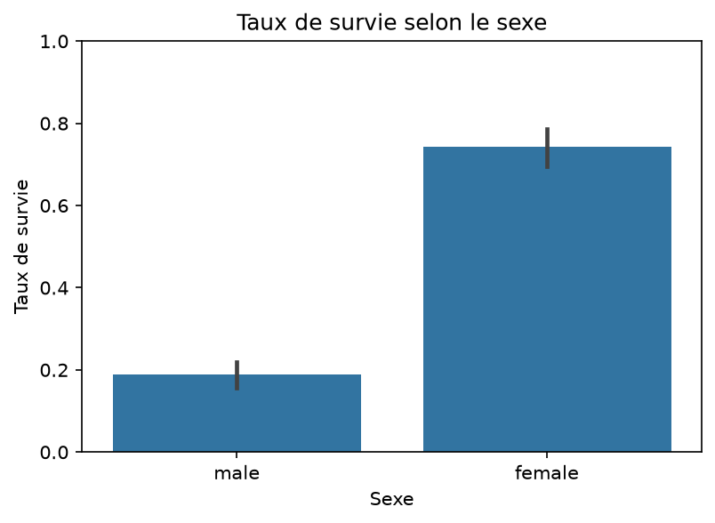
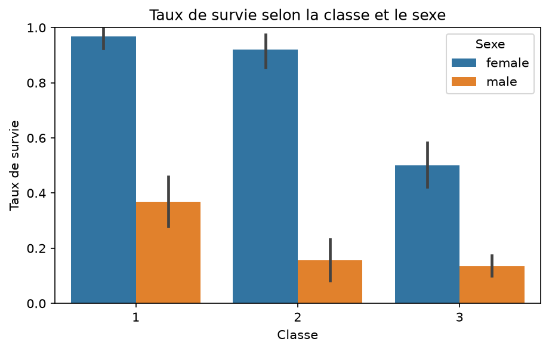
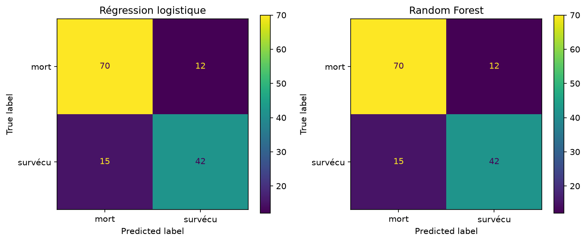
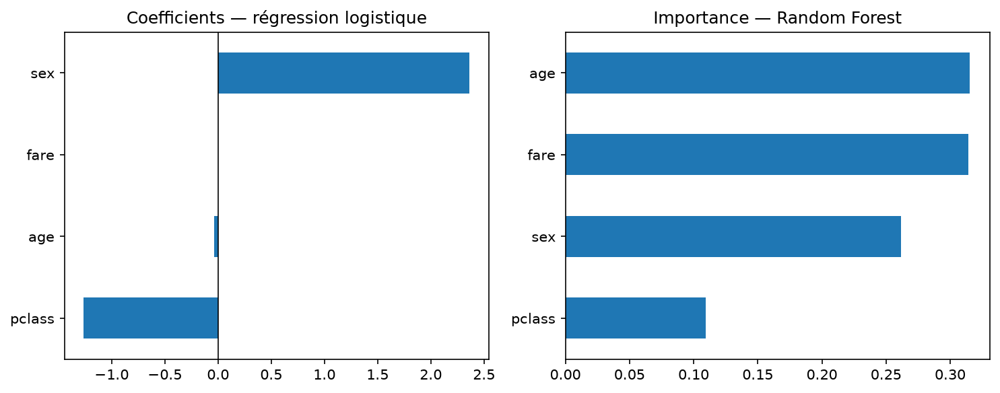

# Analyse de la survie des passagers du Titanic

Projet d’analyse de données : comprendre **quels facteurs ont influencé la survie** (sexe, âge, classe, prix du billet), puis **prédire** la survie avec un modèle simple.

Notebook : [`titanic_analyse.ipynb`](titanic_analyse.ipynb)  
Données : [`titanic.csv`](titanic.csv) (891 passagers, jeu seaborn / Kaggle)

---

## Problématique

Le naufrage du Titanic (1912) a fait une majorité de victimes. La consigne « les femmes et les enfants d’abord » et la classe du billet ont-elles vraiment joué ? Un modèle statistique simple peut-il retrouver cette logique et prédire la survie mieux qu’un hasard ?

---

## Méthode

1. **Exploration** avec pandas (`head`, `info`, `describe`).
2. **Nettoyage des valeurs manquantes** :
   - **Âge** (~20 % manquant) : les lignes incomplètes ont été retirées pour le modèle (`dropna`), pour ne pas inventer d’âge. En analyse descriptive, l’âge observé a été utilisé tel quel.
   - **Cabine / pont** (~77 % manquant) : trop vide, non utilisée dans le modèle.
   - **Port d’embarquement** (~0,2 % manquant) : négligeable.
3. **Visualisation** (seaborn / matplotlib) : survie par sexe, par classe, croisement sexe × classe.
4. **Modélisation** (scikit-learn) :
   - variables : `sex`, `age`, `pclass`, `fare` ;
   - `sex` recodé en 0 (homme) / 1 (femme) ;
   - séparation **train 80 % / test 20 %** (`random_state=42`, `stratify`) ;
   - **régression logistique** et **random forest** ;
   - comparaison par **accuracy** et **matrice de confusion**.

---

## Résultats clés

### Exploration

- Taux de survie global : **38,4 %**. La majorité des passagers n’a pas survécu.
- Femmes : **74,2 %** de survie ; hommes : **18,9 %**.
- 1re classe : **63,0 %** ; 2e : **47,3 %** ; 3e : **24,2 %**.
- Croisement sexe × classe : une femme en 1re classe survit à **96,8 %**, un homme en 3e à **13,5 %**. Le sexe et la classe se **combinent**, ils ne s’additionnent pas seulement.





### Modèles (jeu de test, 139 passagers)

| Modèle | Accuracy |
|---|---|
| Baseline (toujours prédire « mort ») | **59,0 %** |
| Régression logistique | **80,6 %** |
| Random forest | **80,6 %** |

Les deux modèles battent nettement la baseline. Precision / recall sont identiques ici (mort : 0,82 / 0,85 ; survécu : 0,78 / 0,74).



### Quelles variables comptent ?

**Régression logistique** (coefficients) :

| Variable | Coefficient | Lecture |
|---|---|---|
| `sex` | **+2,36** | Être une femme augmente fortement la chance de survie |
| `pclass` | **−1,26** | Plus la classe est élevée (3e), moins on survit |
| `age` | −0,04 | Effet faible : un peu moins de chances en vieillissant |
| `fare` | +0,001 | Quasi nul une fois la classe connue |

**Random forest** (importances) : `age` (0,32) et `fare` (0,31) devant `sex` (0,26) et `pclass` (0,11). La forêt s’appuie beaucoup sur l’âge et le prix, qui varient de façon continue. Le prix est **corrélé à la classe** : un billet cher va souvent avec la 1re classe.



**Conclusion :** le facteur le plus lisible est le **sexe**, suivi de la **classe**. L’âge et le prix du billet aident le modèle d’arbres, mais n’ont pas le même poids interprétable que le sexe dans la logistique.

---

## Limites

- Données de 1912 : corrélation, pas forcément causalité.
- Cabine trop incomplète pour être exploitée.
- Les lignes sans âge ont été enlevées pour le modèle (~177 passagers), ce qui peut légèrement biaiser l’échantillon.
- Pas de validation croisée ni de réglage poussé des hyperparamètres.
- Le paiement / le naufrage réel n’est pas un problème de machine learning : le modèle décrit un schéma statistique.

---

## Relancer le notebook

```bash
python3 -m pip install pandas numpy matplotlib seaborn scikit-learn jupyter
jupyter notebook titanic_analyse.ipynb
```

Charger les données :

```python
import pandas as pd
df = pd.read_csv("titanic.csv")
```
